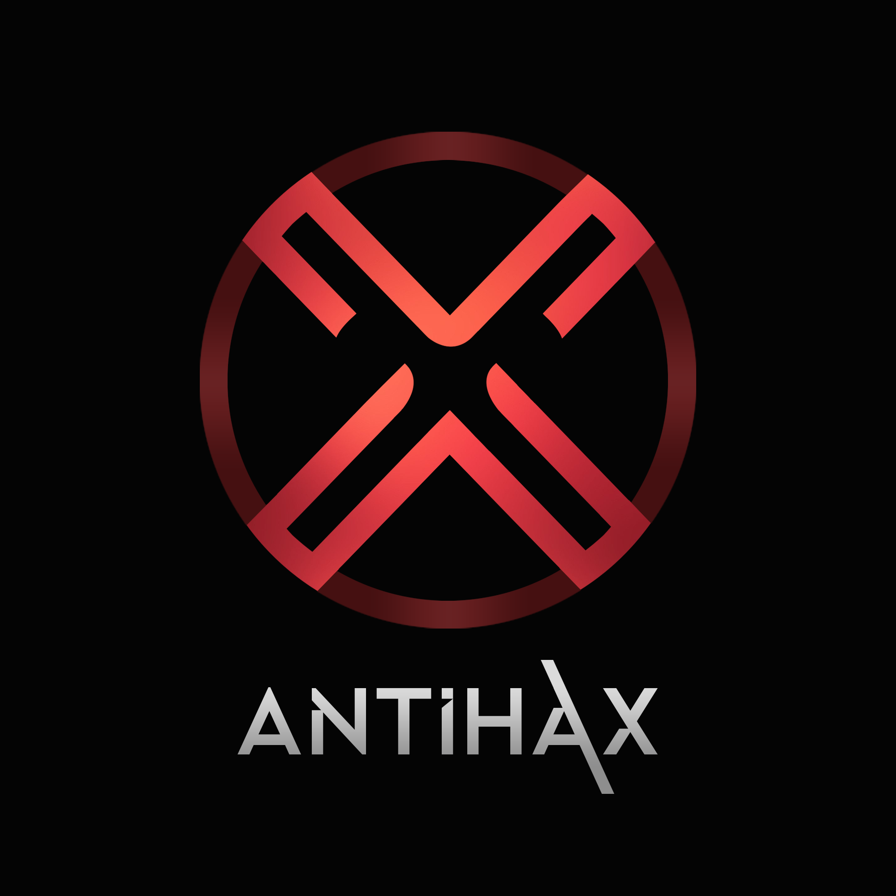

<!--
*** Thanks for checking out this README Template. If you have a suggestion that would
*** make this better, please fork the repo and create a pull request or simply open
*** an issue with the tag "enhancement".
*** Thanks again! Now go create something AMAZING! :D
-->


<!-- PROJECT SHIELDS -->
<!--
*** I'm using markdown "reference style" links for readability.
*** Reference links are enclosed in brackets [ ] instead of parentheses ( ).
*** See the bottom of this document for the declaration of the reference variables
*** for contributors-url, forks-url, etc. This is an optional, concise syntax you may use.
*** https://www.markdownguide.org/basic-syntax/#reference-style-links
-->

<!-- PROJECT LOGO -->
<br />
<p align="center">
  <a href="https://github.com/othneildrew/Best-README-Template">
    
  </a>

  <h3 align="center">Antihax</h3>

  <p align="center">
    A simple virus protection software.


<!-- TABLE OF CONTENTS -->
## Table of Contents

* [About the Project](#about-the-project)
  * [Built With](#built-with)
* [Getting Started](#getting-started)
  * [Running/Installation](#Running/Installation)
* [Contact](#contact)


<!-- ABOUT THE PROJECT -->
## About The Project

[![Product Name Screen Shot][product-screenshot]]

This was an entry for Howdy Hack 2020. This is a more complete and simplified version
I advanced on myself. The password manager was deisgened by Rohan Viswanathan.

### Features
* Offers a full scan of any specified directory and subdirectories for most common viruses.
* Provides a fully functional password manager.
* Can perform a fill backup of any specified directory and subdirectories.


### Built With
This section should list any major frameworks that you built your project using. Leave any add-ons/plugins for the acknowledgements section. Here are a few examples.
* [Python](https://jquery.com)
* [PyQt5](https://pypi.org/project/PyQt5/)
* [Tkinter](https://docs.python.org/3/library/tkinter.html)
* [Yara](https://virustotal.github.io/yara/)


<!-- GETTING STARTED -->
## Getting Started

Info on if you want to give the software a shot.

### Running/Installation

To test out program follow steps

1. Clone the repo
```sh
git clone https://github.com/dylansloann/Antihax.git
```
2. Extract Files

3. Run antivirus.py


<!-- CONTRIBUTING -->
## Contributing

Contributions are **greatly appreciated**. Would love to take this software even further.

1. Fork the Project
2. Create your Feature Branch (`git checkout -b feature/coolfeature`)
3. Commit your Changes (`git commit -m 'Add a feature'`)
4. Push to the Branch (`git push origin feature/coolfeature`)
5. Open a Pull Request


<!-- CONTACT -->
## Contact

Your Name - dylansloann2@gmail.com

Project Link: [https://github.com/dylansloann/Antihax](https://github.com/dylansloann/Antihax)


<!-- MARKDOWN LINKS & IMAGES -->
<!-- https://www.markdownguide.org/basic-syntax/#reference-style-links -->
[contributors-shield]: https://img.shields.io/github/contributors/othneildrew/Best-README-Template.svg?style=flat-square
[contributors-url]: https://github.com/othneildrew/Best-README-Template/graphs/contributors
[forks-shield]: https://img.shields.io/github/forks/othneildrew/Best-README-Template.svg?style=flat-square
[forks-url]: https://github.com/othneildrew/Best-README-Template/network/members
[stars-shield]: https://img.shields.io/github/stars/othneildrew/Best-README-Template.svg?style=flat-square
[stars-url]: https://github.com/othneildrew/Best-README-Template/stargazers
[issues-shield]: https://img.shields.io/github/issues/othneildrew/Best-README-Template.svg?style=flat-square
[issues-url]: https://github.com/othneildrew/Best-README-Template/issues
[license-shield]: https://img.shields.io/github/license/othneildrew/Best-README-Template.svg?style=flat-square
[license-url]: https://github.com/othneildrew/Best-README-Template/blob/master/LICENSE.txt
[linkedin-shield]: https://img.shields.io/badge/-LinkedIn-black.svg?style=flat-square&logo=linkedin&colorB=555
[linkedin-url]: https://linkedin.com/in/othneildrew
[product-screenshot]: photos/GUIexample.png
